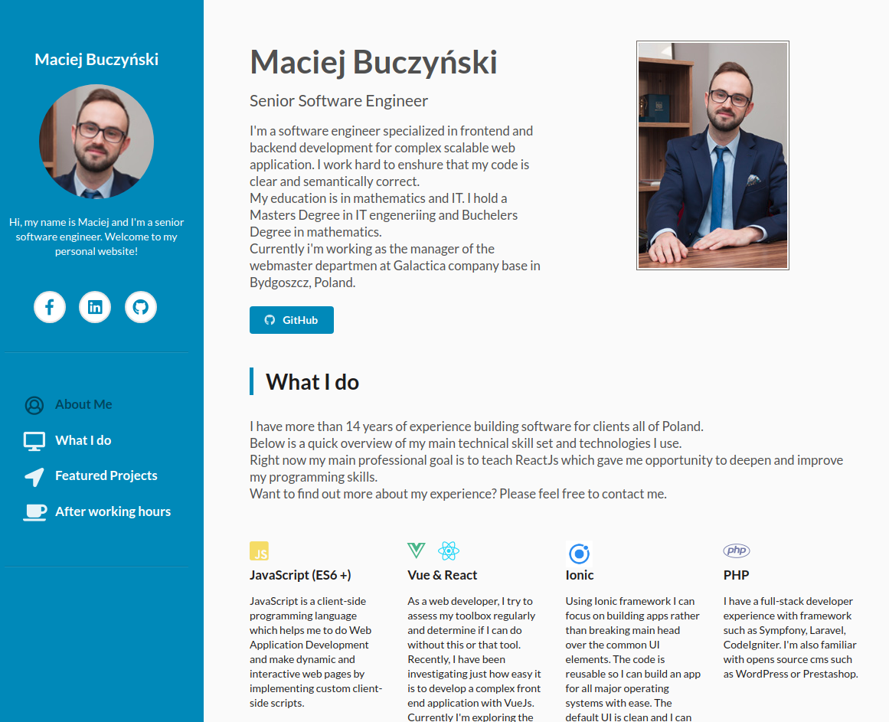

# Personal website.
> Welcome to my personal website!

## Table of contents
* [General info](#general-info)
* [Screenshots](#screenshots)
* [Technologies](#technologies)
* [Setup](#setup)
* [Status](#status)
* [Demo example](#demo-example)
* [Contact](#contact)

## General info
> A page describing who I am, what technologies I use to create projects and what I am interested in

## Screenshots


## Technologies
* [Semantic UI](https://semantic-ui.com/) - HTML, CSS styling template (version 2.4)
* [Symantec Icon](https://semantic-ui.com/elements/icon.html) - free Symantec Icon
* [jQuery](https://jquery.com/) - user library to animated effects (version 3.2.1)
* [Gulp](https://gulpjs.com/) - toolkit to automate & enhance my workflow (version 4.0.2)

## Setup
Project requires [Node.js](https://nodejs.org/) v14+ to run.

Install the dependencies and devDependencies and start the server.

```sh
$ npm install
$ gulp watch
```

For production environments...
```sh
$ the same as above but last commend run
$ gulp
```

## Demo Example
You can find my demo on this link: https://macmac4.github.io/portfolio/

## Status
Project is: _completed_

## Contact
Created by [maciasbuczynski@gmail.com](https://macmac4.github.io/portfolio/) - feel free to contact me!